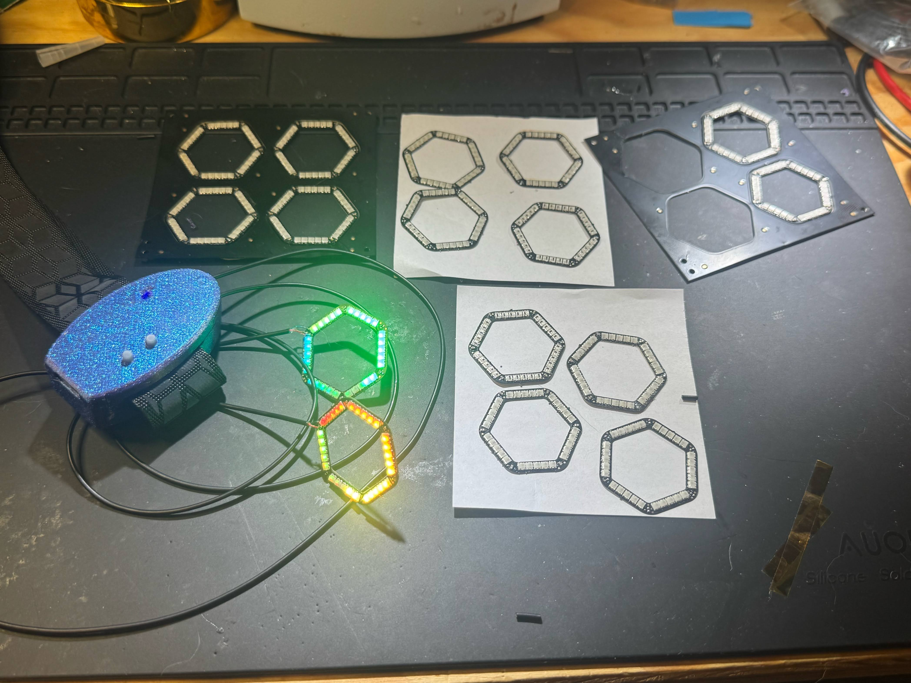
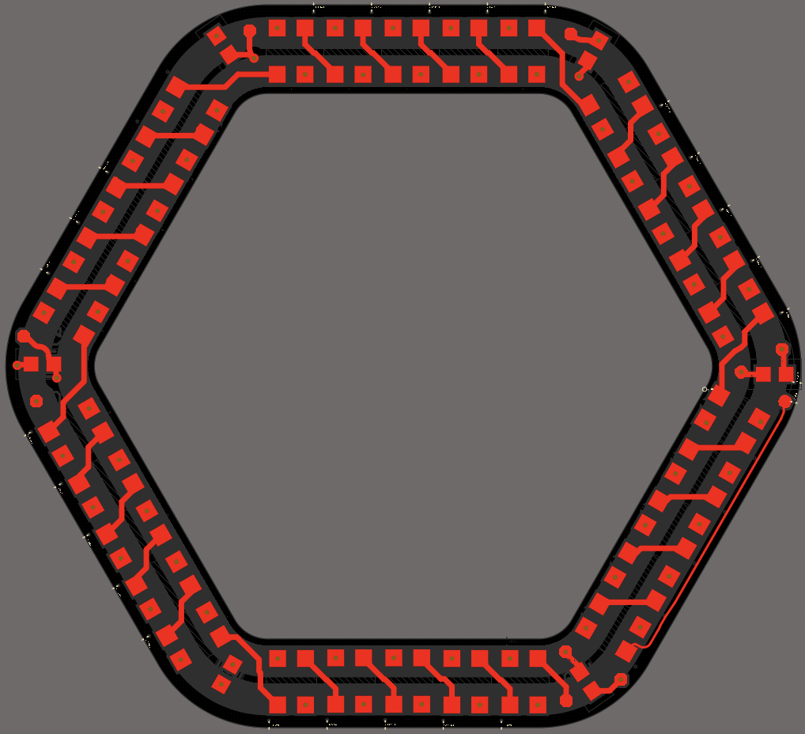
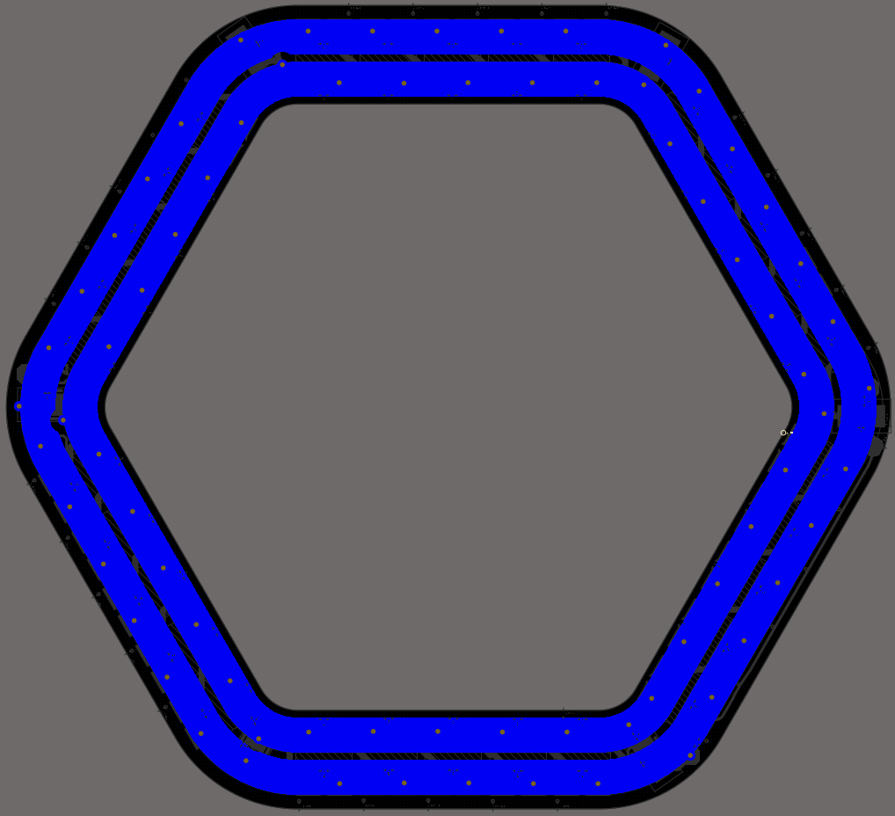
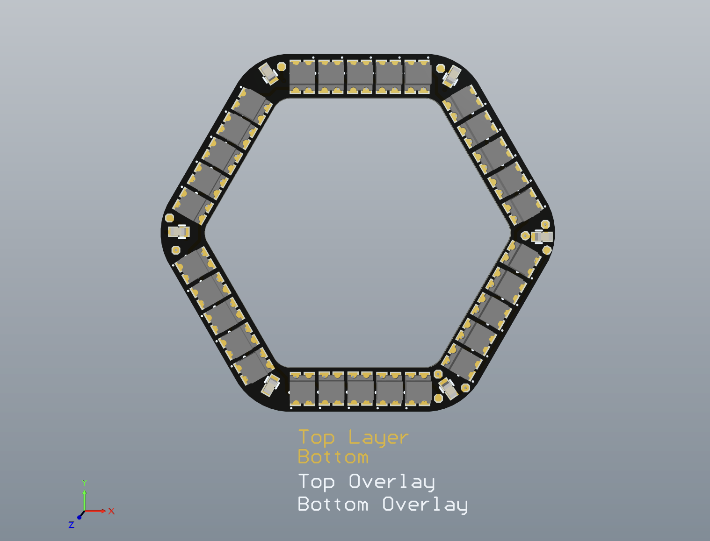
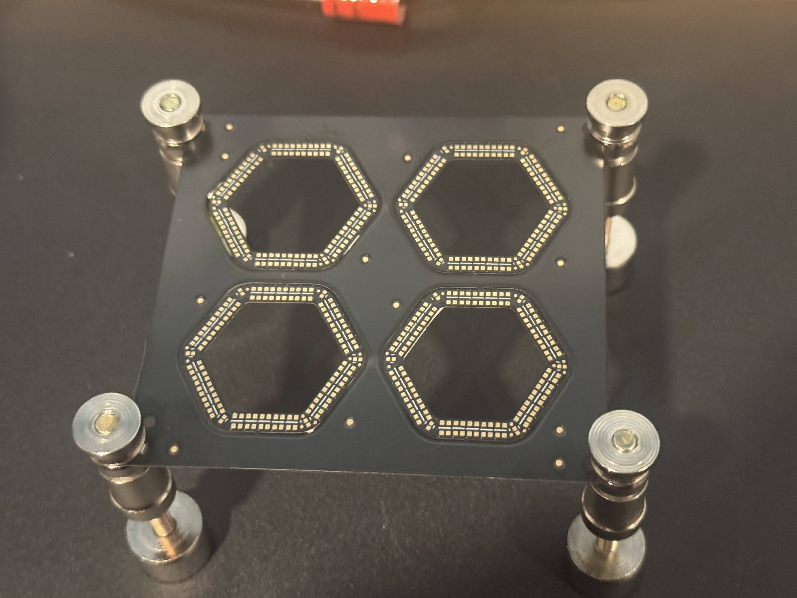

# ext-FlexiGlow LED Guide
 FlexiGlow Wearable Hexagon Neopixels

# FlexiGlow LED Guide

## 📌 Overview
FlexiGlow is a flexible PCB LED module designed for costumes and sci-fi-themed projects. This guide covers the design, assembly, and usage of the FlexiGlow LEDs, including schematics, PCB files, and build instructions.

## 📜 Features
- 🌟 Flexible PCB with addressable LEDs
- 🔧 Compact design with daisy-chain support
- ⚡ Powered via 5V supply
- 📷 Customizable lighting effects via WLED

## 📷 Project Gallery
Here are some images showcasing the design and final assembly of the FlexiGlow LED module.

### PCB Layout:
The hexgons are on a 2-L Flec PCB wih a PI stiffiner and high temperature PSA bottom layer

### PCB Array:

| Part | Quantity | Description |
|------|----------|-------------|
| WS2812B LED | 25 | Addressable LEDs |
| Capacitor 4.7µF | 5 | Power stabilization |
| Flexible PCB | 1 | Custom design |

## 📥 Download Files
The PCB design and schematics are available in the `hardware/` folder.

- **[Schematic PDF](FlexiGlow_Rev_A/Project_Outputs/PDF/FlexiGlow_Rev_A-2025-03-02.PDF)**
- **[PCB Gerber Files](FlexiGlow_Rev_A/Project_Outputs/FlexiGlow_PCBWay_Gerbers_2025-1-20.zip)**
- **[BOM File](FlexiGlow_Rev_A/Project_Outputs/BOM/FlexiGlow_Rev_A_BOM_PCBWay.xlsx)**

## 🔨 Assembly Instructions
1. **Apply the solder paste with the stencil** – Align the stencil and apply the solder paste. 
2. **Place the LEDs and Capacitors** – Place the WS2812B LEDs and caps onto the flexible PCB.
3. **Reflow the FPCs** – Place the array on the hotplate to solder the components.
3. **Test the Circuit** – Connect to a microcontroller and verify LED functionality.
4. **Encapsulation (Optional)** – Use a silicone conformal coating for protection.

## WLED
The project runs WLED firmware
WLED can be installed on this board by using the web installer here: 
https://install.wled.me/

---

📌 **Tip:** Store your images in `docs/images/` for easy reference and organization.
